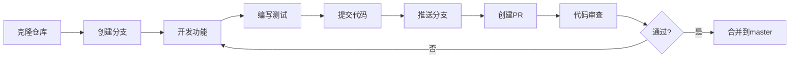

# 贡献指南

感谢你对投资估值系统的关注！我们欢迎任何形式的贡献。

## 📋 目录

- [行为准则](#行为准则)
- [如何贡献](#如何贡献)
- [开发流程](#开发流程)
- [代码规范](#代码规范)
- [提交规范](#提交规范)
- [测试要求](#测试要求)

---

## 🤝 行为准则

### 我们的承诺

为了营造开放和友好的环境，我们承诺让每个人都能参与到项目中来，无论其经验水平、性别、性别认同和表达、性取向、残疾、个人外貌、体型、种族、民族、年龄、宗教或国籍如何。

### 我们的标准

积极行为包括：
- 使用友好和包容的语言
- 尊重不同的观点和经验
- 优雅地接受建设性批评
- 关注对社区最有利的事情
- 对其他社区成员表示同理心

不可接受的行为包括：
- 使用性化语言或图像
- 恶意攻击或侮辱性评论
- 骚扰
- 未经许可发布他人的私人信息
- 其他不专业或不适当的行为

---

## 🚀 如何贡献

### 报告Bug

如果你发现了bug，请：

1. 检查[Issues](../../issues)确保问题未被报告
2. 使用Bug报告模板创建新Issue
3. 提供详细信息：
   - 复现步骤
   - 期望行为
   - 实际行为
   - 截图或录屏
   - 环境信息（OS、浏览器版本等）

### 提出新功能

1. 检查[Issues](../../issues)确保功能未被建议
2. 使用功能建议模板创建新Issue
3. 详细说明：
   - 功能描述
   - 使用场景
   - 预期收益
   - 可能的实现方案

### 提交代码

#### Fork项目

1. Fork本仓库
2. 创建你的功能分支：`git checkout -b feature/AmazingFeature`
3. 提交你的更改：`git commit -m 'feat: add some AmazingFeature'`
4. 推送到分支：`git push origin feature/AmazingFeature`
5. 提交Pull Request

#### 开发环境设置

**后端开发**：
```bash
# 克隆仓库
git clone https://github.com/your-username/investment_valuation.git
cd investment_valuation

# 创建虚拟环境
python -m venv venv
source venv/bin/activate  # Windows: venv\Scripts\activate

# 安装依赖
pip install -r requirements.txt

# 运行开发服务器
python api.py
```

**前端开发**：
```bash
# 进入前端目录
cd frontend-vue

# 安装依赖
npm install

# 运行开发服务器
npm run dev

# 构建生产版本
npm run build

# 类型检查
npm run type-check

# 代码检查
npm run lint
```

---

## 🔄 开发流程

### 1. 分支策略

- `master`: 生产环境分支
- `develop`: 开发环境分支
- `feature/*`: 新功能分支
- `bugfix/*`: Bug修复分支
- `hotfix/*`: 紧急修复分支
- `release/*`: 发布分支

### 2. 工作流程



### 3. Pull Request流程

**PR标题格式**：
- `feat: 添加新功能`
- `fix: 修复bug`
- `docs: 更新文档`
- `style: 代码格式调整`
- `refactor: 重构代码`
- `perf: 性能优化`
- `test: 添加测试`
- `chore: 构建/工具变更`

**PR描述应包含**：
- 变更的动机和目的
- 相关Issue链接
- 变更的详细说明
- 测试情况
- 截图（如适用）

**代码审查标准**：
- 代码符合项目规范
- 有适当的注释
- 有相应的测试
- 文档已更新
- 无明显性能问题

---

## 📐 代码规范

### Python代码规范

遵循 **PEP 8** 规范：

```python
# 好的示例
def calculate_valuation(company: Company) -> float:
    """计算公司估值

    Args:
        company: 公司对象

    Returns:
        估值结果
    """
    return company.revenue * 10


# 不好的示例
def calc(c):
    return c['revenue']*10
```

**关键点**：
- 使用类型注解
- 编写docstring
- 变量命名有意义
- 函数保持简短
- 避免全局变量

### TypeScript/Vue代码规范

遵循 **Vue风格指南**：

```typescript
// 好的示例
const formatMoney = (value: number): string => {
  return (value / 10000).toFixed(2) + ' 亿元'
}

// 不好的示例
function f(v:any){return (v/10000).toFixed(2)}
```

**关键点**：
- 使用TypeScript类型
- 组件命名采用PascalCase
- Props定义详细
- 避免this.$parent
- 使用computed代替filters

### 命名规范

| 类型 | 规范 | 示例 |
|------|------|------|
| 文件名 | kebab-case | `valuation-input.vue` |
| 组件名 | PascalCase | `ValuationInput` |
| 变量名 | camelCase | `companyName` |
| 常量名 | UPPER_SNAKE_CASE | `MAX_VALUE` |
| 类名 | PascalCase | `DataFetcher` |
| 函数名 | camelCase | `calculateValue` |

---

## 📝 提交规范

遵循 [Conventional Commits](https://www.conventionalcommits.org/) 规范：

### 格式

```
<type>(<scope>): <subject>

<body>

<footer>
```

### Type类型

- `feat`: 新功能
- `fix`: Bug修复
- `docs`: 文档变更
- `style`: 代码格式（不影响代码运行）
- `refactor`: 重构
- `perf`: 性能优化
- `test`: 测试相关
- `chore`: 构建/工具变更
- `revert`: 回退提交

### 示例

```bash
# 简单提交
git commit -m "feat: 添加行业数据API接口"

# 详细提交
git commit -m "fix(api): 修复估值计算精度问题

- 使用Decimal代替float处理金额
- 添加四舍五入逻辑
- 更新相关测试用例

Closes #123"
```

---

## ✅ 测试要求

### 后端测试

```python
# 测试示例 (tests/test_valuation.py)
import pytest

def test_dcf_valuation():
    """测试DCF估值"""
    company = Company(
        name="测试公司",
        revenue=100000000,
        # ... 其他参数
    )

    result = calculate_dcf(company)

    assert result.value > 0
    assert result.wacc > 0
    assert result.wacc < 1
```

**测试覆盖率要求**：
- 新代码覆盖率 ≥ 80%
- 关键业务逻辑覆盖率 = 100%

### 前端测试

```typescript
// 测试示例
import { describe, it, expect } from 'vitest'

describe('formatMoney', () => {
  it('should format number to string with unit', () => {
    expect(formatMoney(100000000)).toBe('10.00 亿元')
    expect(formatMoney(0)).toBe('0.00 亿元')
  })

  it('should handle undefined input', () => {
    expect(formatMoney(undefined)).toBe('--')
  })
})
```

### E2E测试

关键业务流程需要E2E测试：
1. 用户注册/登录
2. 创建估值
3. 查看结果
4. 导出报告

---

## 📚 文档要求

### 代码文档

- 公共API必须有docstring
- 复杂逻辑需要注释说明
- 关键算法需要文档

### 用户文档

- 新功能需要更新用户手册
- API变更需要更新API文档
- 重要变更需要在CHANGELOG中记录

---

## 🎨 UI/UX规范

### 设计原则

1. **一致性**: 保持界面风格统一
2. **可用性**: 操作直观易懂
3. **响应式**: 适配不同屏幕尺寸
4. **性能**: 交互流畅无卡顿

### 色彩规范

- 主色: `#667eea`
- 辅色: `#764ba2`
- 成功: `#91cc75`
- 警告: `#fac858`
- 错误: `#ee6666`

---

## 🚦 发布流程

### 版本号规范

遵循 [Semantic Versioning](https://semver.org/):

```
MAJOR.MINOR.PATCH

例如: 1.2.3
- MAJOR: 不兼容的API变更
- MINOR: 向后兼容的功能新增
- PATCH: 向后兼容的Bug修复
```

### 发布清单

- [ ] 所有测试通过
- [ ] 文档已更新
- [ ] CHANGELOG已更新
- [ ] 版本号已更新
- [ ] Release notes已编写
- [ ] 已在测试环境验证
- [ ] 备份已完成
- [ ] 回滚计划已准备

---

## ❓ 获取帮助

如果你有任何问题：

1. 查看[文档](../../wiki)
2. 搜索[Issues](../../issues)
3. 在Issue中提问
4. 联系维护者

---

## 📜 许可证

通过贡献代码，你同意你的贡献将使用项目的[许可证](LICENSE)进行授权。

---

**再次感谢你的贡献！** 🎉
